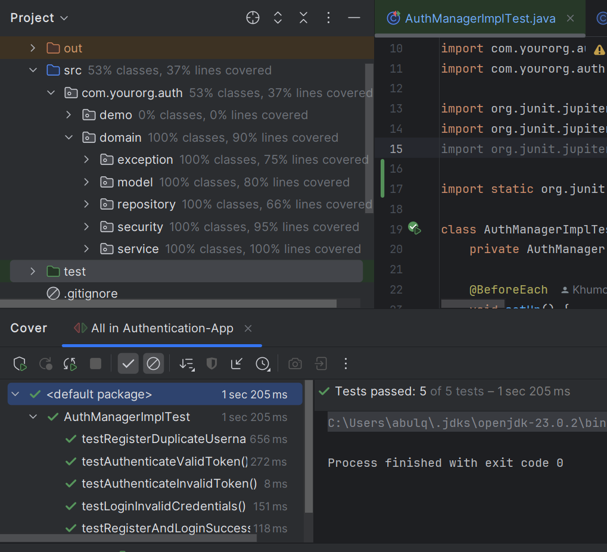
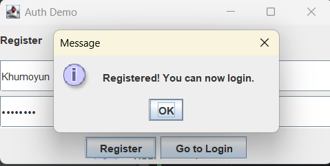
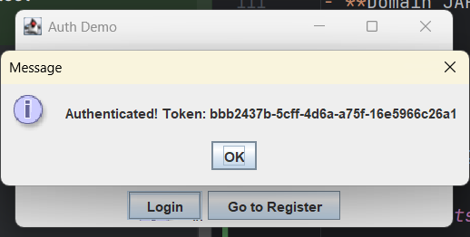
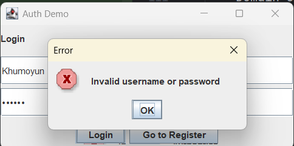

# Authentication-App

A simple Java authentication demo application featuring user registration, login, and token-based authentication. The project uses a modular architecture with clear separation between domain, security, repository, service, and UI layers. The UI is built with Swing for demonstration purposes.

---

## Features

- User registration and login with hashed passwords (PBKDF2 with HMAC SHA-256)
- In-memory user repository (thread-safe, for demo/testing only)
- Token-based authentication using randomly generated UUID tokens
- Simple Swing-based UI for login and registration
- Modular, extensible codebase with clear separation of concerns
- Custom exceptions for authentication errors
- **Domain classes can be packaged as a separate JAR** for reuse in other projects

---

## Project Structure

```
src/
└── com/
    └── yourorg/
        └── auth/
            ├── demo/
            │   ├── AuthFrame.java
            │   ├── Main.java
            │   ├── controller/
            │   │   └── AuthController.java
            │   └── view/
            │       ├── LoginPanel.java
            │       └── RegisterPanel.java
            ├── domain/
            │   ├── exception/
            │   │   ├── AuthException.java
            │   │   ├── InvalidCredentialsException.java
            │   │   └── UserAlreadyExistsException.java
            │   ├── model/
            │   │   └── User.java
            │   ├── repository/
            │   │   ├── InMemoryUserRepository.java
            │   │   └── UserRepository.java
            │   ├── security/
            │   │   ├── PasswordEncoder.java
            │   │   ├── Pbkdf2PasswordEncoder.java
            │   │   ├── TokenService.java
            │   │   └── UuidTokenService.java
            │   └── service/
            │       ├── AuthManager.java
            │       └── AuthManagerImpl.java
```

---

## Getting Started

### Prerequisites

- Java 11 or higher
- [IntelliJ IDEA](https://www.jetbrains.com/idea/) (recommended for building and running)

---

### Running the Application in IntelliJ IDEA

1. **Clone the repository:**
    ```sh
    git clone https://github.com/Khumoyun1307/Authentication-App.git
    cd Authentication-App
    ```

2. **Open the project in IntelliJ IDEA:**
    - Choose "Open" and select the project root directory.

3. **Build the project:**
    - IntelliJ will automatically detect the source structure.
    - You can build the project using `Build > Build Project`.

4. **Run the application:**
    - Right-click on `Main.java` (`com.yourorg.auth.demo.Main`) and select **Run 'Main.main()'**.

---

### Packaging Domain Classes as a JAR

You can package the domain classes (under `com.yourorg.auth.domain`) as a separate JAR for reuse:

1. In IntelliJ IDEA, go to **File > Project Structure > Artifacts**.
2. Click the `+` button and select **JAR > From modules with dependencies**.
3. Choose the module and set the output directory.
4. In the output layout, include only the `com/yourorg/auth/domain` package.
5. Build the artifact via **Build > Build Artifacts**.

You can now use the generated JAR in other projects as a dependency.

---

## Usage

- **Register:** Enter a username and password in the registration panel and click "Register".
- **Login:** Enter your credentials in the login panel and click "Login".
- **Switch Panels:** Use the provided buttons to switch between login and registration.

---

## Notes

- **Security:** This application is for demonstration and educational purposes only. The in-memory repository and UUID token service are not suitable for production use.
- **Extensibility:** You can implement persistent repositories, more secure token services (e.g., JWT), or integrate with real databases by extending the provided interfaces.
- **Domain JAR:** The domain classes are designed to be reusable and can be packaged as a standalone JAR.

---
## Test cases 



## Screenshots from app




## License

GNU GENERAL PUBLIC LICENSE
Version 3

---

**Author:** Khumoyun Abulkosimov